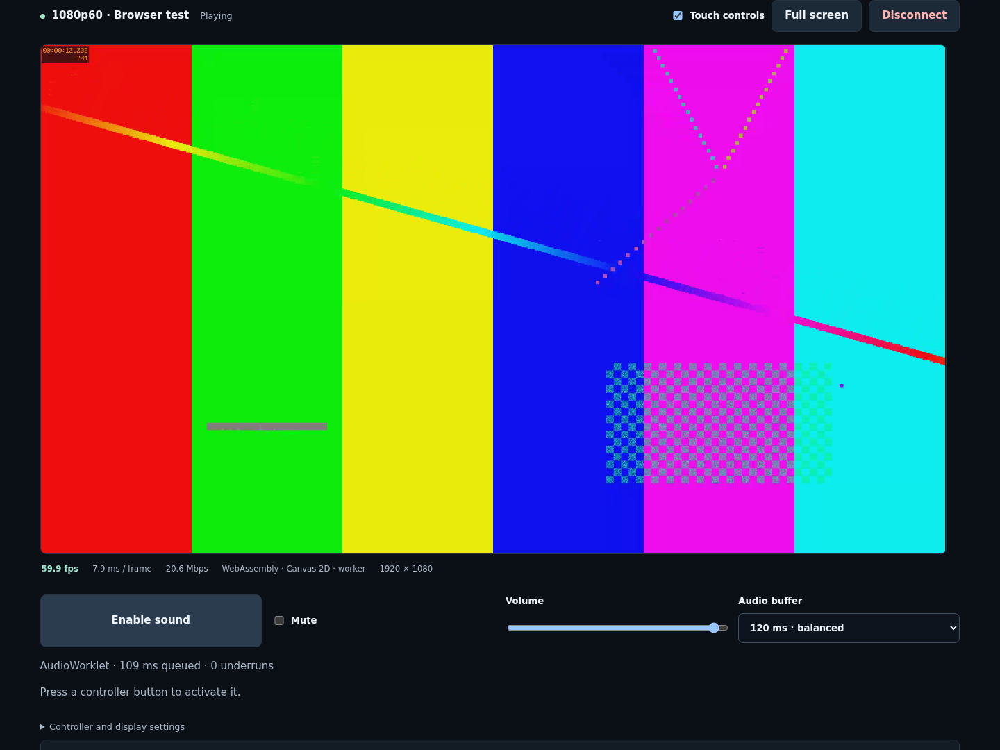
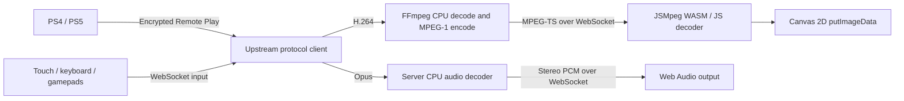

# Canvas Remote Play

A Docker-hosted PlayStation Remote Play client with **software decoding and Canvas 2D rendering**. Based on [o1298098/remote-play](https://github.com/o1298098/remote-play), with a canvas playback approach inspired by [Moonlight Web Tesla](https://github.com/Argon2000/moonlight-web-stream-tsla).

**Default: 1280×720 at 60 fps, 10 Mbps, with stereo audio. Select up to 1080p60.** No GPU, hardware video decoder, WebGL, WebCodecs, physical gamepad or joystick is required. Touch, keyboard, optional gamepads and second-device input are included.

The synthetic video pipeline has been tested at 60 fps in desktop Chromium with GPU acceleration disabled. **A real PlayStation and Tesla browser have not been tested here.** See [validation and performance](docs/validation.md).



## Run

Install Docker with Compose, then run from this directory:

```sh
docker compose up --build -d
```

Open **http://localhost:8080** (or your server's IP and port).

1. Create a local account in the web UI. Login survives page refresh for up to 24 hours; **Sign out** clears the saved session.
2. Click **Start test stream** to check your browser's software playback.
3. Pair your PlayStation using its IP address, your Base64 PSN account ID and the console's Link Device PIN. **Find consoles on this network** shows search progress and results beside the button. If the scan finds nothing, enter the console IP and choose **Check IP address** to search directly.
4. Click **Play**. **Disconnect** ends the Remote Play session and stops its FFmpeg process.

The first build downloads the .NET SDK and FFmpeg and can take a few minutes. PostgreSQL migrations run automatically. Console registrations and accounts persist in `postgres-data`; the generated signing secret persists in `app-data`. There are no GPU device mounts or privileged containers.

After updating the code, run `docker compose up --build -d` and refresh the page.
Docker builds content-versioned asset URLs so browser/CDN caches fetch the updated
client, including its workers and decoders. Restarting an existing container alone
does not rebuild the application.

### Change the port

```sh
cp .env.example .env
```

Set `PORT=18080` in `.env`, then run `docker compose up -d`. Browse to http://localhost:18080. This workspace uses port **18080** because 8080 was occupied.

### Operations

```sh
docker compose ps
docker compose logs --tail 100 remote-play
docker compose down
```

`/healthz` returns `{"status":"ready"}` when the application can reach PostgreSQL. `docker compose down` preserves the named data volumes.

## Pairing and network setup

The Docker server must be able to reach the console on your home network. The browser reaches only this web server. Set a DHCP reservation for the console to keep its IP stable.

- **PS5:** enable Remote Play in Settings → System → Remote Play; use Link Device for the PIN.
- **PS4:** enable Remote Play in Settings → Remote Play Connection Settings; use Add Device for the PIN.
- For wake from rest mode, enable the console's network connection and network wake options. Sony documents these in its [Remote Play setup guide](https://www.playstation.com/en-us/support/games/playstation-remote-play-on-pc-and-mac/).
- The account ID is the **Base64 encoding of your numeric PSN account ID**, not your online name or password. Use your existing Chiaki account ID, or obtain it with [Chiaki-ng's account ID script](https://github.com/streetpea/chiaki-ng/blob/main/scripts/psn-account-id.py). This app does not need your PSN password.
- Pairing requires a fresh PIN from the console even if another local user already paired it. Access to a stream is checked against the signed-in user's paired devices.

Default Compose uses bridge networking and works with a **manually entered console IP**. Broadcast discovery usually cannot cross the Docker bridge. On rootful Linux Docker, enable LAN broadcast discovery with:

```sh
docker compose -f compose.yaml -f compose.host.yaml up --build -d
```

The host-network override requires Compose 2.24.4+ and is intended for rootful Linux. With rootless Docker or Docker Desktop, use the default Compose file, enter the IP manually and choose **Check IP address**. This sends discovery directly to the console instead of relying on broadcasts. If direct discovery fails, check routing/firewalls between Docker and the console; this project does not implement PSN internet traversal between the server and console.

### Access from a Tesla browser

Use a domain and HTTPS reverse proxy reachable by the vehicle. The Moonlight reference reports restrictions on raw IP/local-network access in Tesla browsers. That behavior varies by vehicle/browser version; this implementation still needs testing on the target Tesla.

A Docker HTTPS overlay is included (Compose 2.24.4+). Set
`REMOTE_PLAY_DOMAIN=play.example.com` in `.env`, point that DNS name at your server,
and make TCP ports 80/443 reachable. Start it with:

```sh
docker compose -f compose.yaml -f compose.https.yaml up --build -d
```

Caddy obtains/renews the certificate and proxies WebSockets. This overlay removes
the direct HTTP app port and publishes only the proxy. Use it with the default
bridge configuration; the separate host-network override is for LAN discovery.
No browser-facing UDP media ports, STUN or TURN are required. DNS, routing and
certificate issuance need your real domain; local validation does not prove the
vehicle can reach it.

If you already run Caddy on the host, a minimal configuration is:

```caddyfile
play.example.com {
    reverse_proxy 127.0.0.1:8080
}
```

Use your actual port if changed. Keep the server on a trusted network or behind controlled access, and use HTTPS whenever credentials cross an untrusted network. The app uses the existing local-account model; account creation is open to anyone who can reach it. Database and signing-secret volumes contain sensitive registration material.

## How software playback works



Canvas rendering by itself does not force software video decoding. The Moonlight fork receives already-decoded WebRTC frames. Here, FFmpeg explicitly uses `-hwaccel none`, and the browser decodes MPEG-1 in WebAssembly (or JavaScript), then converts pixels using CPU WASM SIMD (JavaScript fallback) and writes them with `putImageData`. No HTML video element, browser media decoder, WebRTC session, WebGL renderer is created. Audio is decoded on the server and played through Web Audio.

The browser uses an OffscreenCanvas worker where supported. A main-thread Canvas 2D fallback supports browsers without that capability; `?mainThread=1` forces it for diagnosis. Assets, including the decoder, are served locally with no runtime CDN dependency.

**Tradeoffs:** MPEG-1 requires more bandwidth than H.264 and adds a lossy encode step and CPU processing on the server. 720p60 is a requested stream format and performance target, not a guarantee on every CPU. Resolution (360p/540p/720p/1080p), frame rate (30/60) and video bitrate (3–30 Mbps in the UI) are selectable independently. A lower resolution reduces browser CPU work more directly than a lower bitrate.

The test pattern travels through a real H.264 encoder, the production CPU transcoder, WebSocket transport and browser decoder. Its metrics include decoded/displayed fps, separate decode/color/draw costs, superseded frames, received bitrate and server-to-browser timing estimates. They do not measure display scanout or end-to-end controller latency.

## Controls and limits

- Touch: D-pad, move/look direction buttons, face buttons, shoulders, triggers, stick clicks, PS, Share, Options and touchpad click.
- Keyboard: arrows = D-pad; WASD = left stick; IJKL = right stick; X/C/Z/V = cross/circle/square/triangle; Q/E = L1/R1; 1/3 = L2/R2; 2/4 = L3/R3; Enter = Options; Backspace = Share; Space = PS; T = touchpad click.
- Input resets on focus loss, hidden tabs and disconnect. Opposing directions cancel; simultaneous touch and keyboard holds work together.
- One active viewer/session per server. Stop it before connecting another viewer. An abandoned connection expires after missed heartbeats.
- Optional gamepads supply analog sticks/triggers and positional PlayStation buttons. Tesla virtual-controller face swaps, source preference, manual index selection and dead zones are configurable. Polling detects devices even without browser connection events; only one local gamepad is selected to suppress mirrored input.
- No microphone, rumble, motion sensing or touchpad gestures. Touch direction buttons provide full stick deflection. Some games require features beyond these controls.
- No native PSN login or console-to-server relay/TURN. The server connects directly to the paired console.

## Profiles and server performance

| Profile | Resolution | Default video bitrate | Frame rates |
|---|---|---|---|
| Low bandwidth | 640 × 360 | 3 Mbps | 30 / 60 |
| Balanced on slower browsers | 960 × 540 | 6 Mbps | 30 / 60 |
| Default | 1280 × 720 | 10 Mbps | 30 / 60 |
| Full HD | 1920 × 1080 | 20 Mbps | 30 / 60 |

The selected resolution and frame rate are requested from the console and used
by the server encoder. Actual console output depends on its model/firmware and
network. The browser displays the transcoded output dimensions. This does not
prove the console supplied that native resolution. HDR/HEVC output is not exposed
by this software MPEG-1 path.

`DECODER_THREADS=1` and `ENCODER_THREADS=4` independently control FFmpeg's CPU threads (each 1–16). Run the [thread benchmark](docs/optimization.md) before increasing them; extra threads can increase latency. The server
handles H.264 decode, scaling, MPEG-1 encode, Opus decode and audio conversion.
The browser still has to decode MPEG-1 and draw pixels; a powerful server cannot
remove that client CPU cost. Video runs in a worker where available, and audio
can flow directly from that worker to the audio thread without main-thread
scheduling. No one-second TV buffer is added to game video.

Bookmarks accept `?resolution=1080p&fps=60&bitrate=20000`, `controllerMode=auto`,
`controllerIndex=0`, `teslaSwap=on` and `mainThread=1`. Launch overrides do not
change saved controller preferences. Settings apply on the next Play/test launch, or through **Apply selected profile** during playback.

## Adaptive quality and performance

Enable **Automatically adjust quality** to let playback reduce bitrate for network queues, or resolution for browser overload. The chosen profile is the ceiling. It keeps 60 fps where possible, uses 30 fps at the minimum resolution if necessary, and restores quality slowly after sustained healthy playback. Changes reconnect the Remote Play session briefly; attached controllers reconnect through their existing retry flow.

During playback, expand **Playback timing and quality** for separate processing costs, queue delays and the actual profile. **Apply selected profile** disables adaptation and applies your manual choice. Manual mode is the default.

The renderer decodes reference frames but draws only the newest pending image on each display tick. It avoids converting frames that would immediately be overwritten. See [measured results, timing limits and benchmark commands](docs/optimization.md).

## Audio

Console Opus packets are decoded on the server to signed 16-bit PCM. The browser
uses Web Audio's gain/compressor output pattern, informed by the sibling IPTV
player, with an AudioWorklet jitter buffer where available. This audio path uses
no browser codec decoder. Stereo at 48 kHz adds about **1.54 Mbps** before overhead,
separate from the displayed video bitrate.

Audio starts with Play. If autoplay is blocked, tap **Enable sound** or the player.
Use **Mute**, **Volume**, and the **40/120/240 ms audio startup buffer** selector. The default is 120 ms. After priming, timestamp alignment trims stale samples or holds early audio to follow the displayed video; the selected startup buffer is not a fixed playback delay. HTTPS enables
AudioWorklet in browsers requiring a secure context; a scheduled Web Audio
fallback handles browsers without it. Browser UI stalls can interrupt that fallback.
No HTML audio/video element is needed.

The worklet aligns timestamped PCM to each displayed frame using the server's media-ready clock and a small playout reserve. This is approximate A/V synchronization: upstream capture timestamps are unavailable, and the console, decoder and physical outputs add unmeasured delay. It has not been calibrated on real hardware. The demo
includes a low-volume 440 Hz tone, and audio statistics report decoded sample
activity, queued time and underruns. They do not measure the physical speakers.

## Use a phone as the controller

1. Start the stream on the Tesla/viewer.
2. Open the same server on a second device and sign into the **same account**.
3. Choose **Attach input only** in the console library.
4. Use touch, keyboard or a connected gamepad. Video and sound stay on the viewer.

Up to four input clients can attach. They share one PlayStation controller, with
button ownership preserved across clients; the strongest stick displacement and
highest trigger pressure win. Detaching resets only that client's controls.
Connections and tickets are tied to the active session and account. The viewer
shows the attached-device count. A viewer disconnect closes its input clients;
clients retry while the same console stream reconnects.

Connection failures retry up to five times with a fresh ticket and exponential
backoff. Disconnect cancels retries. A failed video worker switches automatically
to main-thread rendering. Fullscreen has a viewport fallback; screen wake lock is
optional and depends on browser support.

See the [Tesla feature audit](docs/tesla-parity.md) for the complete mapping to the
Moonlight fork and the architecture-specific exclusions.

## Development and verification

The frontend is static JavaScript. Docker uses Node in a build stage to version
the web assets; Node is not included in the running server. Local Node is needed
for tests and rebuilding the vendored decoder bundle.

```sh
docker build --target test -t canvas-remote-play-tests .
npm ci
npm test
```

Browser tests expect Chrome at `/usr/bin/google-chrome`; override `CHROME_PATH` if needed. If you changed the server port:

```sh
TEST_URL=http://127.0.0.1:18080 npm test
```

Tests create local accounts with `@example.test` addresses and exercise the synthetic stream. They do not pair a real console. Screenshots and traces go into ignored `test-results/`.

```sh
npm run build:decoder
```

This assembles the checked-in JSMpeg modules. The checked-in WASM binary is extracted unchanged from the pinned upstream distribution; the original C decoder sources are included under `third_party/jsmpeg/wasm/`.

See [source attribution](docs/sources.md), [architecture and protocol](docs/architecture.md), and [validation](docs/validation.md).
