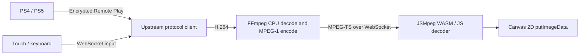

# Canvas Remote Play

A Docker-hosted PlayStation Remote Play client with **software decoding and Canvas 2D rendering**. Based on [o1298098/remote-play](https://github.com/o1298098/remote-play), with a canvas playback approach inspired by [Moonlight Web Tesla](https://github.com/Argon2000/moonlight-web-stream-tsla).

**Default: 1280×720 at 60 fps, 10 Mbps, no audio.** No GPU, hardware video decoder, WebGL, WebCodecs, physical gamepad or joystick is required. Touch buttons and keyboard controls are included.

The synthetic video pipeline has been tested at 60 fps in desktop Chromium with GPU acceleration disabled. **A real PlayStation and Tesla browser have not been tested here.** See [validation and performance](docs/validation.md).


## Run

Install Docker with Compose, then run from this directory:

```sh
docker compose up --build -d
```

Open **http://localhost:8080** (or your server's IP and port).

1. Create a local account in the web UI.
2. Click **Start test stream** to check your browser's software playback.
3. Pair your PlayStation using its IP address, your Base64 PSN account ID and the console's Link Device PIN.
4. Click **Play**. **Disconnect** ends the Remote Play session and stops its FFmpeg process.

The first build downloads the .NET SDK and FFmpeg and can take a few minutes. PostgreSQL migrations run automatically. Console registrations and accounts persist in `postgres-data`; the generated signing secret persists in `app-data`. There are no GPU device mounts or privileged containers.

### Change the port

```sh
cp .env.example .env
```

Set `PORT=18080` in `.env`, then run `docker compose up -d`. Browse to http://localhost:18080. This workspace uses port **18080** because 8080 was occupied.

### Operations

```sh
docker compose ps
docker compose logs --tail 100 remote-play
docker compose down
```

`/healthz` returns `{"status":"ready"}` when the application can reach PostgreSQL. `docker compose down` preserves the named data volumes.

## Pairing and network setup

The Docker server must be able to reach the console on your home network. The browser reaches only this web server. Set a DHCP reservation for the console to keep its IP stable.

- **PS5:** enable Remote Play in Settings → System → Remote Play; use Link Device for the PIN.
- **PS4:** enable Remote Play in Settings → Remote Play Connection Settings; use Add Device for the PIN.
- For wake from rest mode, enable the console's network connection and network wake options. Sony documents these in its [Remote Play setup guide](https://www.playstation.com/en-us/support/games/playstation-remote-play-on-pc-and-mac/).
- The account ID is the **Base64 encoding of your numeric PSN account ID**, not your online name or password. Use your existing Chiaki account ID, or obtain it with [Chiaki-ng's account ID script](https://github.com/streetpea/chiaki-ng/blob/main/scripts/psn-account-id.py). This app does not need your PSN password.
- Pairing requires a fresh PIN from the console even if another local user already paired it. Access to a stream is checked against the signed-in user's paired devices.

Default Compose uses bridge networking and works with a **manually entered console IP**. Broadcast discovery usually cannot cross the Docker bridge. On rootful Linux Docker, enable LAN broadcast discovery with:

```sh
docker compose -f compose.yaml -f compose.host.yaml up --build -d
```

The host-network override requires Compose 2.24.4+ and is intended for rootful Linux. With rootless Docker or Docker Desktop, use the default Compose file and enter the IP manually. If manual discovery fails, check routing/firewalls between Docker and the console; this project does not implement PSN internet traversal between the server and console.

### Access from a Tesla browser

Use a domain and HTTPS reverse proxy reachable by the vehicle. The Moonlight reference reports restrictions on raw IP/local-network access in Tesla browsers. That behavior varies by vehicle/browser version; this implementation still needs testing on the target Tesla.

The proxy must forward WebSocket upgrades to the same app port and allow long-lived connections. A minimal Caddy configuration, when Caddy runs on the Docker host:

```caddyfile
play.example.com {
    reverse_proxy 127.0.0.1:8080
}
```

Use your actual port if changed. Keep the server on a trusted network or behind controlled access, and use HTTPS whenever credentials cross an untrusted network. The app uses the existing local-account model; account creation is open to anyone who can reach it. Database and signing-secret volumes contain sensitive registration material.

## How software playback works



Canvas rendering by itself does not force software video decoding. The Moonlight fork receives already-decoded WebRTC frames. Here, FFmpeg explicitly uses `-hwaccel none`, and the browser decodes MPEG-1 in WebAssembly (or JavaScript), then converts pixels and writes them with `putImageData`. No HTML video element, browser media decoder, WebRTC session, WebGL renderer or audio output is created.

The browser uses an OffscreenCanvas worker where supported. A main-thread Canvas 2D fallback supports browsers without that capability; `?mainThread=1` forces it for diagnosis. Assets, including the decoder, are served locally with no runtime CDN dependency.

**Tradeoffs:** MPEG-1 requires more bandwidth than H.264 and adds a lossy encode step and CPU processing on the server. 720p60 is a requested stream format and performance target, not a guarantee on every CPU. The 6–20 Mbps setting trades picture quality against bandwidth and decoding work. It does not lower the requested resolution or frame rate.

The test pattern travels through a real H.264 encoder, the production CPU transcoder, WebSocket transport and browser decoder. Its metrics are decoded/rendered fps, decode + pixel conversion/draw time per frame, and received bitrate. They do not measure display scanout or end-to-end controller latency.

## Controls and limits

- Touch: D-pad, move/look direction buttons, face buttons, shoulders, triggers, stick clicks, PS, Share, Options and touchpad click.
- Keyboard: arrows = D-pad; WASD = left stick; IJKL = right stick; X/C/Z/V = cross/circle/square/triangle; Q/E = L1/R1; 1/3 = L2/R2; 2/4 = L3/R3; Enter = Options; Backspace = Share; Space = PS; T = touchpad click.
- Input resets on focus loss, hidden tabs and disconnect. Opposing directions cancel; simultaneous touch and keyboard holds work together.
- One active viewer/session per server. Stop it before connecting another viewer. An abandoned connection expires after missed heartbeats.
- No audio, microphone, rumble, motion sensing, physical Gamepad API or touchpad gestures. Direction buttons provide full stick deflection; triggers provide released/fully-pressed states. Some games require features beyond these controls.
- No native PSN login or console-to-server relay/TURN. The server connects directly to the paired console.

## Development and verification

The frontend is static JavaScript; Node is needed only for tests and rebuilding the vendored decoder bundle.

```sh
docker build --target test -t canvas-remote-play-tests .
npm ci
npm test
```

Browser tests expect Chrome at `/usr/bin/google-chrome`; override `CHROME_PATH` if needed. If you changed the server port:

```sh
TEST_URL=http://127.0.0.1:18080 npm test
```

Tests create local accounts with `@example.test` addresses and exercise the synthetic stream. They do not pair a real console. Screenshots and traces go into ignored `test-results/`.

```sh
npm run build:decoder
```

This assembles the checked-in JSMpeg modules. The checked-in WASM binary is extracted unchanged from the pinned upstream distribution; the original C decoder sources are included under `third_party/jsmpeg/wasm/`.

See [source attribution](docs/sources.md), [architecture and protocol](docs/architecture.md), and [validation](docs/validation.md).
