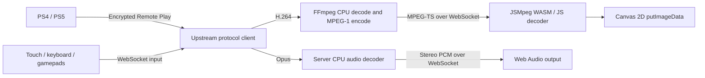

# Player One

PlayStation Remote Play in any browser, built for the Tesla screen. A small
self-hosted server pairs with your PS5 or PS4 and streams it to the browser
over HTTPS: **H.264 (or H.265 on PS5) decoded by the browser's hardware video
decoder** through WebCodecs by default, forwarded frame by frame with no
transcoding in between. A software Canvas 2D renderer remains as the fallback
for browsers without hardware decoding. Based on
[o1298098/remote-play](https://github.com/o1298098/remote-play), with the
canvas fallback inspired by [Moonlight Web Tesla](https://github.com/Argon2000/moonlight-web-stream-tsla).

**Default: 1280×720 at 60 fps, 10 Mbps, H.264, with stereo audio. Select up to
1080p60 and H.265.** No GPU is needed on the server. Tesla is the primary
browser target, with on-screen and keyboard controls; gamepads with rumble and
a phone as a second controller are included.

The synthetic video pipeline has been tested at 60 fps in desktop Chromium with GPU acceleration disabled. **Brief real PS5 streaming checks passed; a Tesla browser has not been tested here.** See [validation and performance](docs/validation.md).


## Deploy

Two supported ways to run the server, plus a domain for HTTPS. HTTPS matters
beyond security: browsers only expose WebCodecs on `https://` or `localhost`,
so H.264 and H.265 modes need a trusted certificate. Plain HTTP on a LAN
address falls back to Canvas software video.

### Option A: Proxmox LXC (recommended)

An unprivileged Debian container with rootful Docker inside and host
networking. The console's UDP stream reaches the app through the kernel alone
and discovery and wake use LAN broadcasts, so no subnet configuration is needed.

The one-command way, on the Proxmox node as root:

```sh
bash -c "$(curl -fsSL https://raw.githubusercontent.com/fabioneves/psrp-web/main/deploy/proxmox/setup.sh)"
```

It asks for a container id, hostname, bridge, storage, address, size and your
domain, then creates the container, installs Docker and the app, and waits for
the HTTPS certificate when a domain was given. Every answer has a default, and
all of them can be passed as environment variables for an unattended run
(`CTID`, `CT_HOSTNAME`, `BRIDGE`, `STORAGE`, `IP`, `GATEWAY`, `CORES`,
`MEMORY`, `DISK`, `DOMAIN`). The full guide with data migration is in
[docs/proxmox-lxc.md](docs/proxmox-lxc.md).

The same steps by hand, on the Proxmox node:

```sh
git clone https://github.com/fabioneves/psrp-web.git && cd psrp-web
CTID=120 HOSTNAME=psrp BRIDGE=vmbr0 STORAGE=local-lvm \
  SSH_KEY=~/.ssh/id_ed25519.pub ./deploy/proxmox/create-lxc.sh
```

This downloads the newest Debian standard template, creates the container with
`nesting=1,keyctl=1` (required by Docker), 4 cores, 4 GB RAM, 16 GB disk and a
bridged interface on DHCP, then starts it. Streaming needs little of either;
the memory covers the image build, which runs inside the container on every
update, and both are ceilings rather than reservations. Set `IP=192.168.1.60/24
GATEWAY=192.168.1.1` for a static address; `CORES`, `MEMORY`, `DISK`,
`TEMPLATE_STORAGE` and `PASSWORD` are also accepted. Give the container a DHCP
reservation or a static address so bookmarks keep working.

Then install inside it:

```sh
pct push 120 deploy/proxmox/install.sh /root/install.sh
pct exec 120 -- sh /root/install.sh
```

The installer adds Docker CE, clones this repository to `/opt/psrp`, writes a
`.env` with a generated database password and host networking, builds the
image and starts the stack. Without a domain the app answers on port 80, so it
prints `http://<container address>/`; with a domain the app moves to 8080
behind Caddy on 80 and 443. `PORT`, `HTTP_PORT` and `HTTPS_PORT` override
all three. To add HTTPS in the same step, run it as
`REMOTE_PLAY_DOMAIN=play.example.com sh /root/install.sh` after finishing the
domain setup below.

Updates: `pct exec 120 -- /usr/local/bin/psrp update` from the node, or `psrp update` inside
the container. It refuses while a stream is running (`--force` overrides),
saves the current log to `~/psrp-logs`, fast-forwards the checkout, rebuilds,
waits for the health check and prunes the old image. `psrp status`,
`psrp logs`, `psrp restart`, `psrp backup`, `psrp restore <dir>` and `psrp diagnostics` are there too. Signed-in users see an
"Update available" notice in the header when the repository's main branch has moved on (set
`UPDATE_CHECK_REPO=` to disable the check, or to `owner/name` for a fork).

### Option B: Docker Compose

Any Linux, macOS or Windows host with Docker and Compose 2.24 or newer:

```sh
git clone https://github.com/fabioneves/psrp-web.git && cd psrp-web
cp .env.example .env        # optional: PORT, DB_PASSWORD, DISCOVERY_SUBNETS
docker compose up --build -d
```

Open **http://localhost:8080**, or the server's IP and port. To use another
port set `PORT=18080` in `.env` and rerun `docker compose up -d`.

Two things depend on how Docker runs:

- **Console discovery.** Rootful Docker on Linux can use host networking, which
  makes LAN broadcast discovery and wake work natively:
  `docker compose -f compose.yaml -f compose.host.yaml up --build -d`.
  Rootless Docker and Docker Desktop cannot broadcast from a container; set
  `DISCOVERY_SUBNETS=192.168.1.0/24` (your LAN) in `.env` so discovery probes
  the subnet directly, or use **Check IP address** for a known console.
- **Stream quality.** Rootless Docker and Docker Desktop relay every packet
  through a user-space network stack, which can drop parts of a 10 Mbps
  stream under load. See [Rootless Docker and periodic loss](#rootless-docker-and-periodic-loss).
  Rootful Docker with host networking, or Option A, avoids the relay.

The first build downloads the .NET SDK, FFmpeg and a pinned Chiaki-ng library
for PSN pairing. PostgreSQL migrations run automatically. There are no GPU
device mounts or privileged containers.

Updates: `git pull && docker compose up --build -d`, then refresh the page. The
build versions asset URLs so browsers and CDNs fetch the updated client;
restarting an existing container alone does not rebuild anything.

### Domain and HTTPS

1. Choose a hostname, for example `play.example.com`, and create a DNS **A**
   record (and **AAAA** if you have IPv6) pointing at your public IP. For a
   dynamic IP use a dynamic DNS provider and a CNAME.
2. On your router, forward public TCP **80** and **443** to the server: the
   LXC's address for Option A, the Docker host for Option B. Port 80 is needed
   for certificate issuance and the HTTP-to-HTTPS redirect. If only a
   nonstandard public port is possible, certificate validation needs a DNS
   provider integration instead; see
   [Caddy's certificate validation requirements](https://caddyserver.com/docs/automatic-https#acme-challenges).
3. In `.env` set:

   ```dotenv
   REMOTE_PLAY_DOMAIN=play.example.com
   # Option A (LXC, host networking):
   COMPOSE_FILE=compose.yaml:compose.host.yaml:compose.https.yaml:compose.lxc.yaml
   # Option B (bridge networking):
   COMPOSE_FILE=compose.yaml:compose.https.yaml
   ```

   Caddy answers on 80 and 443 by default: as listen ports in the LXC (host
   networking) and as published ports in bridge mode. `HTTP_PORT` and
   `HTTPS_PORT` in `.env` override both. With rootless Docker, which cannot
   bind ports below 1024, set `HTTP_PORT=18090` and `HTTPS_PORT=18443` and
   forward public 80 → 18090 and 443 → 18443.
4. Run `docker compose up --build -d`. Caddy obtains and renews the Let's
   Encrypt certificate and proxies the app, including its WebSockets. No
   browser-facing UDP, STUN or TURN ports are needed.
5. Verify from outside your network: `curl -f https://play.example.com/healthz`
   returns `{"status":"ready","streams":0}`. `docker compose ps` shows the
   `proxy` service healthy once the certificate is issued.

The overlay binds the plain HTTP port to loopback; set `HTTP_BIND=0.0.0.0` if
you also want direct HTTP access on the LAN. Certificates persist in the
`caddy-data` volume. To turn HTTPS off, remove `COMPOSE_FILE` from `.env` and
run `docker compose up -d`; accounts and pairings are kept.

If a reverse proxy already terminates TLS on the host, skip the overlay and
point it at the app port with WebSocket support, for example in Caddy:

```caddyfile
play.example.com {
    reverse_proxy 127.0.0.1:8080
}
```

Keep the server behind HTTPS with a strong owner password: the database and
`app-data` volumes hold pairing credentials and the login signing secret.
Registration is open only until the first account exists, unless
`ALLOW_REGISTRATION=true` is set.

### First use

1. On a fresh server the sign-in page asks you to create the owner account; after that, sign-ups are closed and the page only signs in. Accounts are saved in PostgreSQL. Refresh restores login silently for up to 24 hours; **Sign out** clears it. To let other people in your household create their own accounts, set `ALLOW_REGISTRATION=true` in `.env`; each account pairs its own console.
2. Select a nearby console, or choose **Add console** to enter its IP address.
3. Choose **Sign in to PSN**, sign in on Sony's page, then paste its final redirect URL back into setup. The app saves and encodes your account ID. Choose **Pair automatically**; if it fails, use **Pair with a PIN** and enter the console's Link Device PIN.
4. Click **Play**; a console in rest mode is woken automatically before connecting. A sleeping console shows **Wake up**, a ready one **Put console to sleep**; the card's status dot is green when ready and amber in rest mode. **Stream settings** offers resolutions through 1080p60, with bitrate and frame pacing under **Advanced**. **Start test stream** checks browser playback. **Disconnect** ends the session.

Manual account-ID entry and public online-name lookup are also available under PIN pairing. The public lookup provider may be unavailable; Sony sign-in does not depend on it. See [setup details and verification limits](docs/psn-setup.md).

### Operations, logs and backups

```sh
docker compose ps
docker compose logs --tail 100 remote-play
docker compose down          # keeps the data volumes
```

`/healthz` returns `{"status":"ready","streams":0}` when the application can reach
PostgreSQL; `streams` is 1 while a console or test stream is running. Rebuilding
or restarting the container ends that stream, so check it first. Recreating the
container also discards its log, so save it before an update:

```sh
mkdir -p ~/psrp-logs && docker compose logs --timestamps remote-play > ~/psrp-logs/$(date -u +%Y%m%dT%H%M%SZ).log
```

Accounts and console registrations persist in the `postgres-data` volume; the
login signing secret and PSN token-encryption keys persist in `app-data`. Keep
both volumes when upgrading and back up both together; on Proxmox a container
snapshot or `vzdump` covers them. [docs/proxmox-lxc.md](docs/proxmox-lxc.md)
shows how to move both to a new instance.

### Rootless Docker and periodic loss

A real PS5 session logged a 2.5 to 3 second video blackout every 63 seconds:
60 seconds of status-update interval plus a 3 second discovery timeout. The
container's own UDP buffers never overflowed, but the host's did, in the
sockets of `slirp4netns`, the user-space network relay that rootless Docker
routes every container packet through. The background console status scan
adds enough work to that relay to drop the stream for the length of the scan.
The scan now skips while a stream is running. If you must stay on rootless
Docker, switch its network driver to `pasta` (install the `passt` package and
set `Environment=DOCKERD_ROOTLESS_ROOTLESSKIT_NET=pasta` in a drop-in under
`~/.config/systemd/user/docker.service.d/`), which maps UDP flows socket to
socket instead of running a user-space TCP/IP stack. Restarting the daemon for
that change stops every container; containers without a restart policy have
to be started again by hand. Rootful Docker with `compose.host.yaml`, or the
Proxmox LXC path, avoids the relay entirely.

### Corrupt frames and keyframes

WebCodecs closes the decoder on a corrupt frame, which the console produces
after packet loss. The browser now replaces the decoder, keeps the session,
asks the server for a keyframe (`{"type":"keyframe"}`, viewer only) and
resumes at the next IDR. Four failures within 30 seconds reconnect instead.
A console that reports "still occupied" after a drop is retried every four
seconds for a minute before the attempt counter applies.

### Session URLs

Playing a console moves the address to `#/play/<console id>` and the test
stream to `#/test`, so a refresh reconnects to the same console after the
saved login restores. Back returns to the library and ends the session;
Disconnect clears the address. The page stays at the top when a session starts.

### Tesla theater

The sign-in page and the library carry an **Open in Tesla theater** link. It goes
through YouTube's redirect so the car opens the app in its fullscreen theater
browser; the car must be parked. Sign in there once and the saved session
restores on later launches.

## Pairing and network setup

The Docker server must be able to reach the console on your home network. The browser reaches only this web server. Set a DHCP reservation for the console to keep its IP stable.

- **PS5:** enable Remote Play in Settings → System → Remote Play; use Link Device for the PIN.
- **PS4:** enable Remote Play in Settings → Remote Play Connection Settings; use Add Device for the PIN.
- The console list refreshes its status from network discovery. Wake waits for the console to report ready and only operates on your paired consoles.
- For wake from rest mode, enable the console's network connection and network wake options. Sony documents these in its [Remote Play setup guide](https://www.playstation.com/en-us/support/games/playstation-remote-play-on-pc-and-mac/).
- **Sign in to PSN** fills and saves your account ID and enables automatic pairing. Your PSN password stays on Sony's page. Access/refresh tokens are encrypted on the server for pairing.
- Alternatively, use public online-name lookup or paste a **numeric PSN account ID**; it is encoded automatically. Existing Base64 IDs from Chiaki also work.
- Automatic pairing requires the PSN account on the console and working PSN connectivity. PIN pairing requires a fresh console PIN. Each local user must pair their own console; stream access is checked against their device bindings.

The Proxmox LXC path and rootful Docker with `compose.host.yaml` discover
consoles by LAN broadcast without further settings. Default Compose uses bridge
networking; to enable **automatic network discovery** when Docker cannot forward
LAN broadcasts, set your LAN subnet in `.env` and recreate the service:

```dotenv
DISCOVERY_SUBNETS=192.168.1.0/24
```

```sh
docker compose up --build -d
```

**Find consoles on this network** then probes the configured LAN directly; no
console IP needs to be entered. Use your actual LAN subnet. The setting accepts
up to four comma-separated private IPv4 CIDRs, `/24` through `/30`, with at most
1,016 addresses total. Searches send PS4 and PS5 discovery requests only, share a
bounded timeout and deduplicate replies. Container interfaces cannot reliably
reveal the host's LAN, so this setting must be supplied for rootless Docker.

With no subnet configured, discovery uses broadcasts. On rootful Linux Docker,
enable LAN broadcast discovery with:

```sh
docker compose -f compose.yaml -f compose.host.yaml up --build -d
```

The host-network override requires Compose 2.24.4+ and is intended for rootful
Linux. With rootless Docker or Docker Desktop, use the default Compose file with
`DISCOVERY_SUBNETS`. **Check IP address** remains available for a single known
console. If direct discovery fails, check routing/firewalls between Docker and
the console; this project does not implement PSN internet traversal between the
server and console.

### Access from a Tesla browser

Use a domain with HTTPS reachable by the vehicle, set up as in
[Domain and HTTPS](#domain-and-https). The Moonlight reference reports
restrictions on raw IP and local-network access in Tesla browsers; that
behaviour varies by vehicle and browser version, and only a trusted certificate
enables the H.264 and H.265 modes there. Local validation does not prove the
vehicle can reach the address.

## How software playback works



Canvas rendering by itself does not force software video decoding. The Moonlight fork receives already-decoded WebRTC frames. Here, FFmpeg explicitly uses `-hwaccel none`, and the browser decodes MPEG-1 in WebAssembly (or JavaScript), then converts pixels using CPU WASM SIMD (JavaScript fallback) and writes them with `putImageData`. No HTML video element, browser media decoder, WebRTC session, WebGL renderer is created. Audio is decoded on the server and played through Web Audio.

The browser uses an OffscreenCanvas worker where supported. A main-thread Canvas 2D fallback supports browsers without that capability; `?mainThread=1` forces it for diagnosis. Assets, including the decoder, are served locally with no runtime CDN dependency.

**Tradeoffs:** MPEG-1 requires more bandwidth than H.264 and adds a lossy encode step and CPU processing on the server. 720p60 is a requested stream format and performance target, not a guarantee on every CPU. Resolution (360p/540p/720p/1080p), frame rate (30/60) and video bitrate (3–30 Mbps in the UI) are selectable independently. A lower resolution reduces browser CPU work more directly than a lower bitrate.

The test pattern travels through a real H.264 encoder, the production CPU transcoder, WebSocket transport and browser decoder. Its metrics include decoded/displayed fps, separate decode/color/draw costs, superseded frames, received bitrate and server-to-browser timing estimates. They do not measure display scanout or end-to-end controller latency.

## Controls and limits

- Touch: D-pad, move/look direction buttons, face buttons, shoulders, triggers, stick clicks, PS, Share, Options and touchpad click.
- Keyboard: arrows = D-pad; WASD = left stick; IJKL = right stick; X/C/Z/V = cross/circle/square/triangle; Q/E = L1/R1; 1/3 = L2/R2; 2/4 = L3/R3; Enter = Options; Backspace = Share; Space = PS; T = touchpad click.
- Input resets on focus loss, hidden tabs and disconnect. Opposing directions cancel; simultaneous touch and keyboard holds work together.
- One active viewer/session per server, including browser test streams. Run diagnostics in a separate Compose project while a console viewer is active. An abandoned connection expires after missed heartbeats.
- Optional gamepads supply analog sticks/triggers and positional PlayStation buttons and are detected automatically; the Controls tab shows the detected pad and a live readout of what the browser receives. Tesla virtual-controller face swaps, source preference, index override and dead zones sit under Advanced controller overrides, which opens by itself when an override is active or is the reason a connected pad is not used, with a Reset to automatic button. Nintendo pads without a standard browser mapping use the raw Switch layout. Console rumble reaches the pad through the browser's dual-rumble actuator (DualSense and Xbox pads in Chrome); the DualSense speaker, haptics and adaptive triggers are not reachable from a browser. Invert stick up / down is available under the overrides. Polling detects devices even without browser connection events; only one local gamepad is selected to suppress mirrored input.
- No microphone, rumble, motion sensing or touchpad gestures. Touch direction buttons provide full stick deflection. Some games require features beyond these controls.
- PSN sign-in and pinless registration use a server-side Chiaki helper. Media playback connects directly from the server to the LAN console; internet media relay is not implemented.

### Reducing input delay

When your browser and server are on the same LAN, use the server's local address
and configured port to avoid routing the stream through a public proxy. For this
server address in your own deployment.
The same database accounts and paired consoles are available, but a different
origin needs its own sign-in. Compare **Stream diagnostics → Round trip**.
A powerful encoder cannot remove internet routing delay. Keep 720p60 as a starting
profile; use lower resolution if browser decoding cannot sustain the frame rate.

## Profiles and server performance

| Profile | Resolution | Default video bitrate | Frame rates |
|---|---|---|---|
| Low bandwidth | 640 × 360 | 3 Mbps | 30 / 60 |
| Balanced on slower browsers | 960 × 540 | 6 Mbps | 30 / 60 |
| Default | 1280 × 720 | 10 Mbps | 30 / 60 |
| Full HD | 1920 × 1080 | 20 Mbps | 30 / 60 |

The selected resolution and frame rate are requested from the console and used
by the server encoder. Actual console output depends on its model/firmware and
network. The browser displays the transcoded output dimensions. This does not
prove the console supplied that native resolution. HDR/HEVC output is not exposed
by this software MPEG-1 path.

`DECODER_THREADS=1` and `ENCODER_THREADS=4` independently control FFmpeg's CPU threads (each 1–16). Run the [thread benchmark](docs/optimization.md) before increasing them; extra threads can increase latency. The server
handles H.264 decode, scaling, MPEG-1 encode, Opus decode and audio conversion.
The browser still has to decode MPEG-1 and draw pixels; a powerful server cannot
remove that client CPU cost. Video runs in a worker where available, and audio
can flow directly from that worker to the audio thread without main-thread
scheduling. No one-second TV buffer is added to game video.

Bookmarks accept `?resolution=1080p&fps=60&bitrate=20000`, `controllerMode=auto`,
`controllerIndex=0`, `teslaSwap=on` and `mainThread=1`. Launch overrides do not
change saved controller preferences. Settings are saved to your account and follow you to any browser you sign in from; the first sign-in from a browser that already has local settings uploads them. Settings apply on the next Play/test launch. During playback, changes to video mode, resolution, frame rate, bitrate, pacing and automatic quality are a draft until you press **Apply**; the saved selection survives reloads either way.

## Adaptive quality and performance

Enable **Automatically adjust quality** to let playback reduce bitrate for sustained network queuing (six seconds, so a short Wi-Fi burst costs nothing), or resolution for browser overload. The chosen profile is the ceiling. It keeps 60 fps where possible, uses 30 fps at the minimum resolution if necessary, and restores quality slowly after sustained healthy playback. Changes reconnect the Remote Play session briefly; attached controllers reconnect through their existing retry flow.

The debug HUD reports server-to-canvas age, network round trip, arrival jitter (p95 and longest gap between video packets reaching the browser), presentation stalls per second, frame interval p95 and max, console packet loss and keyframe requests, and audio queue and underruns. During playback, expand **Stream diagnostics** below the player for separate processing costs, queue delays, console→server packet loss and keyframe requests, and a list of recent stalls, superseded frames, audio underruns and reconnects. **Download diagnostics log** saves the last five minutes of per-second metrics and every event as JSON for analysis; the debug HUD has the same button. **Send to server** stores the same capture on the server for browsers that cannot save files, such as a Tesla, and **Saved diagnostics** in the lobby lists and downloads them from any device signed in to the account (`psrp diagnostics` copies them out on the server). The server logs a console stream summary with the loss counters when a session ends. Use the **Picture** tab for the selected profile. **Apply** applies changed settings during playback. Manual quality is the default.

Smooth frame pacing primes one frame interval, keeps up to three decoded images to absorb uneven delivery, and skips an image that has waited 2.5 intervals when a newer one is ready. Responsive pacing draws only the newest pending image for the lowest delay. Both modes reuse pixel storage and skip color conversion for discarded frames. If browser animation callbacks stall during fullscreen or a display change, presentation uses a timer and resumes animation callbacks when they return, without reconnecting the console. See [measured results, timing limits and benchmark commands](docs/optimization.md).

## Video modes

**Video mode** in Stream settings offers four choices, saved to your account:

| Mode | Server work | Browser work |
| --- | --- | --- |
| Canvas · software | Decode H.264, encode MPEG-1 | Software WASM decoding and Canvas 2D |

Under Advanced, **Video output** defaults to a video element fed through a MediaStream where the
browser supports it (Chrome and other Chromium browsers) and falls back to drawing on a canvas; on a
120 Hz MacBook the element felt smoother in play even though both paths measured the same cadence. The element reports when
each frame reached the screen, and diagnostics record that as display timing, which the canvas path
cannot measure.
| Automatic (default) | H.265 on a PS5, H.264 otherwise, whichever the browser decodes in hardware | WebCodecs decoding and Canvas 2D |
| H.264 · browser decoding | Forward each H.264 access unit as-is | WebCodecs decoding and Canvas 2D |
| H.265 · PS5, browser decoding | Request PS5 HEVC SDR, forward each access unit as-is | WebCodecs HEVC decoding and Canvas 2D |

H.264 and H.265 first request `prefer-hardware`. If that is unsupported, the app
tries browser decoding with `no-preference` before changing codecs or using Canvas.
The playback label reports which request was accepted. The browser decides which decoder it
uses; this is a [WebCodecs preference](https://www.w3.org/TR/webcodecs/#hardware-acceleration),
not a guarantee. Neither native mode decodes or re-encodes video on the server.
Audio and input work in all three modes. No server GPU is required.

Unsupported H.265 falls back to H.264, then Canvas. PS4 skips H.265. Native decoder
failures also fall back, while retaining the saved selection for the next Play.
The status beneath Video mode retains the decoder error when a failure caused the fallback.
Use HTTPS or localhost for WebCodecs; ordinary LAN HTTP uses Canvas. Changing modes
while playing reconnects. An older disabled hardware-acceleration preference
migrates to Canvas automatically.

The console receives the selected resolution, frame rate and bitrate, capped at
15 Mbps. Higher bitrate settings only affect the Canvas MPEG-1 output. Playback
statistics report actual output. H.265 requires browser HEVC support, which varies
by device. Its Annex B stream includes VPS/SPS/PPS on keyframes as required by the
[WebCodecs HEVC registration](https://www.w3.org/TR/webcodecs-hevc-codec-registration/).

## Disconnecting sessions

**Console settings** on a paired card opens that console without connecting: its live status, Play, wake or sleep, recovery, and an optional **custom settings** profile. With the switch on, the Stream settings block edits a profile that applies only when that console plays; the shared settings return once the session ends, and the card lists the custom profile.

**Disconnect all sessions**, under **Trouble connecting?** on a paired console card, in Console settings or in the player, stops this
server's viewer and attached controllers for that console, including a connection
still starting. It revokes pending tickets and waits for server cleanup. Browsers
receive an explicit stop signal so they do not automatically reclaim the console.
The action requires a signed-in account paired with that console. It cannot kick
sessions opened by other Remote Play applications.

Browser heartbeats start during connection setup. An abandoned connection without
a heartbeat expires after 10 seconds; normal disconnects release its video stream
and console control socket. Console control-socket closure also cleans up the
server session. A responsive browser watching without pressing buttons stays
connected.

## Audio

Console Opus packets are decoded on the server to signed 16-bit PCM. The browser
uses Web Audio's gain/compressor output pattern, informed by the sibling IPTV
player, with an AudioWorklet jitter buffer where available. This audio path uses
no browser codec decoder. Stereo at 48 kHz adds about **1.54 Mbps** before overhead,
separate from the displayed video bitrate.

Audio starts with Play. If autoplay is blocked, open the **Sound** tab and tap **Enable sound**, or tap the player.
Use **Mute**, **Volume**, and the **40/120/240 ms audio startup buffer** selector. The default is 120 ms. After priming, gradual sample-clock correction follows the displayed video. Only large timing discontinuities trim stale samples or hold early audio; the selected startup buffer is not a fixed playback delay. HTTPS enables
AudioWorklet in browsers requiring a secure context; a scheduled Web Audio
fallback handles browsers without it. Browser UI stalls can interrupt that fallback.
No HTML audio/video element is needed.

The worklet aligns timestamped PCM to each displayed frame using the server's media-ready clock and a small playout reserve. This is approximate A/V synchronization: upstream capture timestamps are unavailable, and the console, decoder and physical outputs add unmeasured delay. It has not been calibrated on real hardware. The demo
includes a low-volume 440 Hz tone, and audio statistics report decoded sample
activity, queued time and underruns. They do not measure the physical speakers.

## Use a phone as the controller

1. Start the stream on the Tesla/viewer.
2. Open the same server on a second device and sign into the **same account**.
3. Choose **Attach input only** in the console library.
4. Use touch, keyboard or a connected gamepad. Video and sound stay on the viewer.

Up to four input clients can attach. They share one PlayStation controller, with
button ownership preserved across clients; the strongest stick displacement and
highest trigger pressure win. Detaching resets only that client's controls.
Connections and tickets are tied to the active session and account. The viewer
shows the attached-device count. A viewer disconnect closes its input clients;
clients retry while the same console stream reconnects.

Connection failures retry up to five times with a fresh ticket and exponential
backoff. The player, fullscreen state, settings and scroll position stay in place
during retries. Connection messages remain visible when retries stop; disconnect
and press **Play** to start another connection. Authentication, pairing and active-viewer conflicts
show their error without repeatedly reconnecting. New connections wait up to eight
seconds for the previous viewer to release its slot; a still-active stream gets
an explicit conflict message. Disconnect cancels retries. A failed video worker switches automatically
to main-thread rendering. Fullscreen has a viewport fallback; screen wake lock is
optional and depends on browser support.

See the [Tesla feature audit](docs/tesla-parity.md) for the complete mapping to the
Moonlight fork and the architecture-specific exclusions.

## Development and verification

The frontend is static JavaScript. Docker uses Node in a build stage to version
the web assets; Node is not included in the running server. Local Node is needed
for tests and rebuilding the vendored decoder bundle.

```sh
docker build --target test -t player-one-tests .
npm ci
npm test
```

Browser tests expect Chrome at `/usr/bin/google-chrome`; override `CHROME_PATH` if needed. If you changed the server port:

```sh
ALLOW_REGISTRATION=true docker compose up --build -d   # tests create accounts freely
TEST_URL=http://127.0.0.1:18080 npm test
```

Tests create local accounts with `@example.test` addresses and exercise the synthetic stream. They do not pair a real console. Screenshots and traces go into ignored `test-results/`.

```sh
npm run build:decoder
```

This assembles the checked-in JSMpeg modules. The checked-in WASM binary is extracted unchanged from the pinned upstream distribution; the original C decoder sources are included under `third_party/jsmpeg/wasm/`.

See [source attribution](docs/sources.md), [architecture and protocol](docs/architecture.md), and [validation](docs/validation.md).


## Player One interface

The retro interface uses custom pixel art and self-hosted fonts. Video presets, codec tiles, resolution and frame rate are always visible in the console library; bitrate and frame pacing sit under an Advanced disclosure that opens automatically when they differ from the defaults. Custom Canvas, H.264 (default), and H.265 tiles replace the codec dropdown. During a session, a smaller player sits beside the Control deck on wide screens; the deck stacks below on phones. Picture, Sound, and Controls tabs keep settings easy to reach, with touch buttons for short option lists. Quick presets select the Compatibility Canvas fallback at 720p60, the default balanced H.264 720p60, or H.264 1080p60. Resolution, bitrate, frame pacing, sound, touch controls, and debug preferences persist in this browser.

- **Full screen** hides app controls and statistics. Exit with Escape or double-click/double-tap on the picture. Browsers without the Fullscreen API use a viewport-filling theater view; browser chrome cannot be hidden by the app in that fallback.
- **Start in fullscreen**, the labeled icon toggle to the left of each Play button, is off by default and saved per browser. When checked, Play enters fullscreen immediately while connecting. Test streams and input-only attachments keep their normal view.
- **Touch fullscreen exit:** swipe down on the picture to return to the Control deck. With touch controls off, a tap also reveals a large **Exit fullscreen** button for five seconds. Double-tap and Escape remain available. In fullscreen, **two-finger tap** toggles debug, **three-finger tap** toggles touch controls, and **swipe left/right** cycles HUD layouts while debug is on. These gestures work with native fullscreen and the iPhone-style theater fallback.
- **On-screen controller** buttons always sit under the video in the normal layout for mouse, keyboard and touch use. The **Fullscreen touch overlay** switch (off by default) also shows them over fullscreen video.
- **Debug HUD** (or **Shift+D**) has three saved layouts, selected with illustrated buttons: **Detailed** keeps all metrics and the FPS graph; **Minimal** shows FPS, codec, and resolution; **Horizontal** spans the top edge with smaller text, mint video, blue network, amber timing, and pink audio groups, plus a tiny FPS graph on wider screens. Pixel headings and colored dividers separate the readings; codec appears once without the redundant hardware-preference description. All have translucent backgrounds. **Shift+H** cycles layouts while debug is on, including in fullscreen. Compact layouts let taps pass through to the picture. Detailed includes frame interval p95, estimated video age, decode/draw times, audio queue/underruns and Copy diagnostics; copied data contains no account credentials or stream tickets.
- **Smooth** pacing trades a small video buffer for fewer dropped frames. **Responsive** minimizes delay. See [comparison and timing limits](docs/retro-player.md).
- **Put console to sleep** requests rest mode from a paired console, then releases this server's session. It works from the library or player. An idle console uses a short authenticated control connection; an already sleeping console is left asleep. Enable network wake in the console's rest-mode settings to wake it again remotely.

[Artwork provenance and generation prompt](docs/artwork.md).
