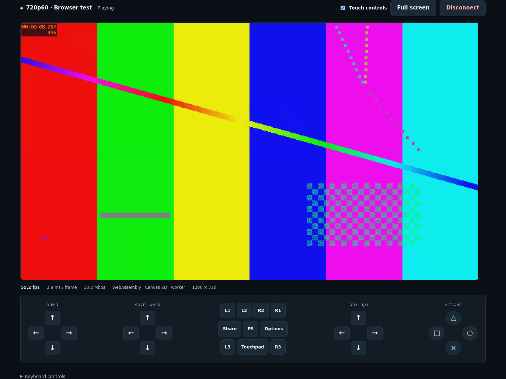
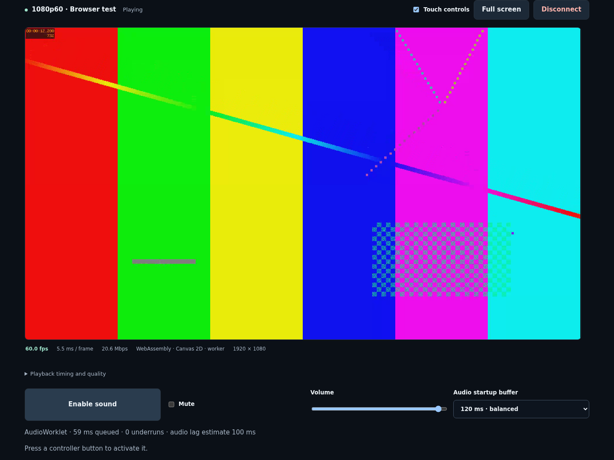

# Validation

## Environment

- Tested on 2026-09-15 in a Linux x86-64 workspace.
- CPU reported by the environment: Intel Core Ultra 9 285HX, 12 exposed vCPUs.
- Docker Engine 29.6.2, rootless; .NET 10, PostgreSQL 17, FFmpeg 6.1.1.
- Desktop Google Chrome, launched by Playwright with:

```text
--disable-gpu
--disable-accelerated-video-decode
--disable-accelerated-2d-canvas
--disable-webgl
```

## Observed playback

The real H.264 test generator → CPU FFmpeg transcoder → WebSocket → JSMpeg WASM
→ Canvas2D worker path rendered 1280×720 video at **60.0 fps**, around **3.5 ms
per decoded/rendered frame** and **10.3 Mbps** in the initial captured run.
The browser test waits for more than 300 new frames after warmup, checks measured
fps, captures the screen and reconnects. The main-thread software fallback also
renders successfully with GPU acceleration disabled.



These are short synthetic-stream measurements on this workstation. They do not
establish Tesla performance, sustained thermally limited performance, actual
display refresh rate, game image quality or controller-to-photon latency.

## Automated coverage

- Backend compilation and PostgreSQL migration/startup in Docker.
- Ticket owner retention, expiry, single use and unknown-token rejection.
- Authenticated device ownership, bitrate validation and blocked legacy endpoints.
- Concurrent-viewer rejection and cleanup after malformed socket input.
- Annex B IDR gating, codec headers and removal of the upstream packet type byte.
- Queue overflow fails explicitly; no silent reference-frame dropping.
- Real generated H.264 through the receiver/transcoder; FFprobe checks 720p60,
  MPEG-1 and the absence of audio tracks.
- Password hash work factor and correct/incorrect password verification.
- Simultaneous touch/keyboard ownership, opposing directions, and focus-loss reset.
- Browser signup, library, real video rendering, metrics, disconnect/reconnect.
- Library layout overflow checks at 320, 768, 1024 and 1440 pixels.
- Worker and main-thread renderers, with no HTML audio/video elements.
- JavaScript fallback with WebAssembly unavailable and native media constructors
  made to throw if called.

The initial release passed 19 backend assertions, 3 input unit tests and 5 browser/API tests. NuGet's transitive vulnerability audit and npm's dependency audit reported
no known vulnerable packages at validation time. Existing upstream compiler
warnings remain; no warning suppressions were added.

## Hardware acceptance still required

No PlayStation or Tesla was available in this environment. Before calling console
support validated, test both the target PS4/PS5 firmware and actual Tesla browser:

1. Pair using a real PIN and account ID; verify waking from rest mode.
2. Run a game at 720p60 for at least ten minutes and observe fps, bitrate and CPU.
3. Verify buttons, movement, camera, triggers, simultaneous touch, and input reset.
4. Disconnect, reconnect, close the browser, and interrupt the network; confirm
   the console session and FFmpeg processes terminate cleanly.
5. Test the real remote network/domain/HTTPS path and check input latency.

The application requests the selected profile and never silently switches to hardware decoding.
A browser CPU that cannot sustain the workload can select a lower resolution/frame
rate; no universal 720p60 or 1080p60 guarantee is made.

## Tesla controls, audio and Full HD update

The 1080p60 synthetic run measured **60.1 fps**, **6.9 ms per decoded/drawn frame**,
and **20.7 Mbps video** with GPU acceleration disabled. The audio worklet reported
about **109 ms queued** and **zero underruns** in the captured run. Stereo PCM adds
approximately 1.54 Mbps. Audio sample RMS exceeded 0.01; this establishes decoded
signal activity, not sound from physical Tesla speakers.

The test waits for more than 600 video frames and separately blocks the browser
main thread for 500 ms. Audio underruns did not increase, because PCM travels
from the WebSocket worker directly to the audio worklet. This does not guarantee
continuity through longer network interruptions or on different hardware.

Additional automated coverage:

- Real generated Opus packets through the console receiver to signed stereo PCM.
- Analog trigger pressure, clamping, and per-device input ownership on detach.
- Tesla Nintendo wrapper swaps, manual overrides, mirrored-device selection,
  duplicate IDs at distinct indexes, dead zone and disconnected-device reset.
- Same-account input-only attachment, video continuity, cross-account rejection,
  four-client cap, cancellation when the viewer ends, and stale-session tickets.
- Real 360p30, 540p60 and 1080p60 outputs, plus the existing 720p60 test.
- Connection retry with a fresh ticket, retry cancellation and worker fallback.
- Web Audio scheduling fallback, PCM validation and bounded jitter-buffer behavior.
- Mobile input-only layout, browser capability diagnostics and audio controls.
- Docker HTTPS overlay parses; Caddy validates its configuration. Public DNS,
  certificate issuance and the Tesla network route require deployment-specific testing.

The updated suite passed 29 backend assertions, 10 JavaScript unit tests and
12 browser/API tests. Tests use synthetic media and simulated gamepad snapshots;
physical controllers, PlayStation playback, speaker output and A/V alignment still
require target-device acceptance. No test authenticates to PSN or modifies a console.


## Performance and adaptive quality update (2026-09-15)

The final software-only 1080p60 run reported **60.0 fps**, **5.5 ms per displayed
frame** (3.1 ms decode/copy, 1.6 ms SIMD color conversion, 0.8 ms canvas draw), and
**20.6 Mbps video**. Audio queued about 59 ms and reported **zero underruns** in
this run, including the existing 500 ms main-thread stall check. A 20 ms reserve
trial reported one underrun; the final 40 ms reserve favors continuity. Neither
run measures physical sound or controller-to-screen latency.

Thirty backend assertions, twenty JavaScript unit tests and all fourteen browser/API
tests passed. After the final audio reserve adjustment, the 1080p60/audio and
scheduled-audio fallback checks were rerun and passed. The burst test separately
verified that its superseded-frame count increases after a 500 ms stall and
playback returns to the selected 30 fps profile.

New coverage includes timestamp envelopes and offset estimation, timestamped audio
trim/hold, byte-exact SIMD conversion, newest-frame ownership, adaptive hysteresis
and limits, manual 540p30 reconnect, and real reconnect under simulated sustained
CPU pressure. The automatic test restores 1080p through a manual override. Existing
software fallbacks, authorization, phone input, gamepad and cleanup tests still pass.

See [measurement methods and reproduction commands](optimization.md),
[final browser metrics](benchmarks/browser-1080p60.json),
[earlier low-reserve trial](benchmarks/browser-low-reserve.json),
[pixel timings](benchmarks/pixels.json) and [thread timings](benchmarks/threads.json).
These are desktop Chrome and synthetic input results; real console/Tesla validation
and A/V calibration are still required.



## Discovery feedback and saved login

Discovery now reports searching, empty results, failures and selections beside
its button. A browser regression holds the response open to verify visible
progress, then covers empty, failed and successful searches with retry.

Login now survives refresh through a scoped HttpOnly session cookie. Browser tests
verify restoration, sign-out across refresh, clearing an invalid saved token and
rejecting cross-origin session requests. Backend checks cover the required request
header, cookie attributes, HTTPS proxy behavior and same-site cross-origin rejection.
The existing 24-hour token expiration remains in effect.

Validation passed: 34 backend assertions, 20 JavaScript unit tests and all 17
browser/API tests, including the existing software video/audio and input flows.
Docker was rebuilt and the health endpoint reports ready.

### Saved-session compatibility follow-up

A regression reproduced a successful login with no saved cookie when an older,
already-open client omitted the new session header. Same-origin legacy login
requests now receive the cookie; session restore/logout keep their stricter request
checks. The compatibility test gives the old script its own ETag and verifies that
reload fetches the updated client and restores the saved login. A separate test
covers visible feedback when saved-session readback fails.

Validation: 36 backend assertions and 20 unit tests passed. All 19 browser/API
scenarios passed across the full run and the focused session rerun. An additional
real Chrome check through a local HTTPS proxy confirmed Secure/HttpOnly/Strict
cookie creation, restoration after reload, and sign-out after reload. The user's
specific URL/browser path still needs confirmation if the issue persists there.
